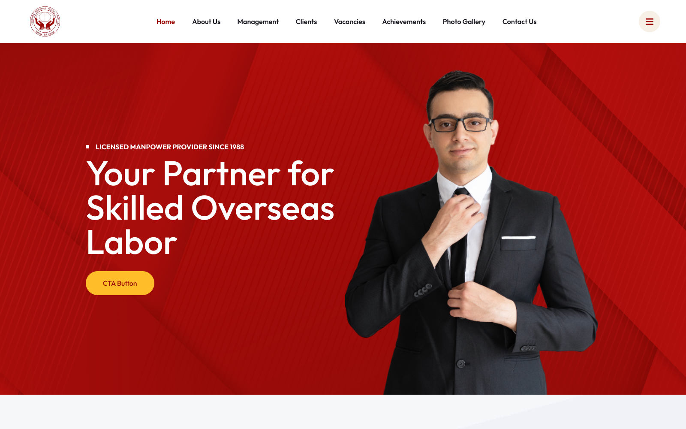

# Upcountry Manpower Agency (UMA) | Global Recruitment Portal

[](https://upcountry-manpower-agency.vercel.app/)
[](https://www.figma.com/proto/59oJhWX3k5Hz92kELYmN8S/Upcountry-Manpower-Agency---Sri-Lanka?page-id=0%3A1&node-id=1-2434&viewport=258%2C-881%2C0.11&t=57QNpNVIAcvJRhPf-1&scaling=scale-down&content-scaling=fixed&starting-point-node-id=1%3A2434)

## 📱 Project Preview
<p align="center">
  
</p>

## 🚀 The Problem & Solution
**The Problem:** As a Sri Lanka–based agency, UMA needed a high-trust digital presence to connect local talent with international employers. The existing challenge was presenting complex recruitment data in a clean, authoritative way that appealed to both job seekers and global corporate partners.

**The Solution:** I developed a structured website using a custom WordPress architecture. By blending custom PHP logic with a responsive Bootstrap frontend, I created a reliable ecosystem for manpower solutions that balances professional aesthetics with easy content management.

---

## 🛠️ Tech Stack & Tools
* **CMS:** WordPress (Custom Theme Development)
* **Backend:** PHP, MySQL
* **Frontend:** HTML5, CSS3, JavaScript, jQuery
* **Framework:** Bootstrap 5
* **Design:** UI/UX focus on "Trust & Authority"

---

## ✨ Key Features
* **Global Accessibility:** Engineered for seamless performance across different regions and devices.
* **Custom CMS Integration:** Tailored WordPress backend allowing the client to manage job listings and agency updates easily.
* **Responsive Recruitment Flows:** Optimized layouts for high-stakes data presentation and international service listings.
* **Professional UI:** A clean, blue-and-white color palette designed to establish immediate market credibility.

---

## 📂 Project Structure
```text
├── assets/             # Brand identity and site media
├── css/                # Custom styling and Bootstrap overrides
├── js/                 # Form validation and UI interactions
├── index.php           # WordPress template entry
└── style.css           # Main stylesheet and theme metadata
